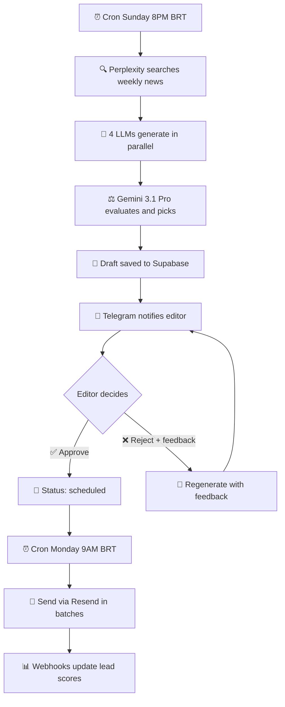

# AI Health Newsletter

*Automated weekly AI-in-healthcare newsletter, built for Brazilian hospital managers.*

[](https://nextjs.org/)
[](https://typescriptlang.org/)
[](https://supabase.com/)
[](https://vercel.com/)
[](https://resend.com/)
[](https://core.telegram.org/bots)

<!-- Add a landing page screenshot here:
<p align="center">
  
</p>
-->

---

## 💡 What Is This

Hospital directors, superintendents, and managers in Brazil need to keep up with AI advances in healthcare — but don't have time to sift through dozens of sources every week.

**AI Health Newsletter** solves that: every Monday morning, a curated edition lands in the manager's inbox with the most relevant AI-in-healthcare news of the week — written in a consultative, practical tone, like a conversation between colleagues (inspired by Andrew Ng's "The Batch").

The twist: **all content is AI-generated**. Four language models write versions in parallel, a fifth model evaluates and picks the best one, and a human editor approves or requests changes via Telegram before sending.

---

## ✨ Highlights

- **🤖 Multi-model pipeline** — 4 LLMs generate in parallel, 1 evaluator (Gemini) picks the best
- **📱 Telegram approval** — review the draft, approve or request changes with inline buttons
- **📊 Automatic lead scoring** — every open, click, and interaction updates the subscriber's score
- **📧 Resend delivery** — batches of 50, exponential backoff retry, event tracking
- **🖥️ Full admin dashboard** — leads with temperature, newsletter editions, engagement analytics
- **⏰ Fully automated** — cron generates Sunday night, sends Monday morning
- **💰 Zero cost to start** — runs on free tiers of Vercel, Supabase, and Resend

---

## 🏗️ Architecture



### Models used

| Stage | Model | Provider |
|---|---|---|
| News search | `sonar-pro` | Perplexity |
| Generation (x4) | `deepseek-v3.2`, `gemini-3-flash`, `qwen3.5-397b`, `kimi-k2.5` | OpenRouter |
| Evaluation | `gemini-3.1-pro-preview` | OpenRouter |

---

## 🛠️ Tech Stack

| Category | Technology |
|---|---|
| Framework | Next.js 16 (App Router), React 19, TypeScript |
| Styling | Tailwind CSS, shadcn/ui |
| Database | Supabase (PostgreSQL) |
| Email | Resend + Svix (webhook verification) |
| AI | OpenRouter (multi-model), Perplexity (search) |
| Bot | Telegram Bot API |
| Hosting | Vercel (serverless + cron jobs) |
| Testing | Vitest, Testing Library |

---

## 📁 Project Structure

```
ai-health-newsletter/
├── app/
│   ├── page.tsx                    # Landing page
│   ├── admin/                      # Admin dashboard (leads, editions, analytics)
│   ├── preview/[token]/            # Public newsletter preview
│   ├── cancelar/                   # Unsubscribe page
│   └── api/
│       ├── subscribe/              # Subscription with rate limiting
│       ├── confirm/                # Email confirmation
│       ├── unsubscribe/            # Unsubscribe
│       ├── cron/generate/          # Cron: generate newsletter (Sun 11PM UTC)
│       ├── cron/send/              # Cron: send newsletter (Mon 12PM UTC)
│       ├── telegram/webhook/       # Telegram approval workflow
│       ├── webhooks/resend/        # Email events (Resend)
│       └── admin/                  # Admin panel API routes
├── lib/
│   ├── ai/
│   │   ├── pipeline.ts             # Multi-model pipeline + evaluator
│   │   ├── perplexity.ts           # News search
│   │   ├── openrouter.ts           # OpenRouter client
│   │   └── newsletter-template.ts  # Email HTML template
│   ├── telegram.ts                 # Telegram Bot helpers
│   ├── newsletter-sender.ts        # Batch sending via Resend
│   ├── lead-scoring.ts             # Score calculation per event
│   ├── admin-auth.ts               # HMAC admin authentication
│   └── rate-limit.ts               # Rate limiting via Supabase
├── components/                     # React components (landing + admin)
├── supabase/migrations/            # SQL schema (3 migrations)
├── scripts/                        # Setup and test scripts
├── docs/DEPLOY.md                  # Full deployment guide
└── vercel.json                     # Cron job configuration
```

---

## 🚀 Getting Started

### Prerequisites

- Node.js 18+
- Accounts on: [Supabase](https://supabase.com), [Resend](https://resend.com), [OpenRouter](https://openrouter.ai), [Perplexity](https://perplexity.ai)
- A [Telegram Bot](https://core.telegram.org/bots#botfather) created via @BotFather

### Installation

```bash
git clone https://github.com/YOUR_USERNAME/ai-health-newsletter.git
cd ai-health-newsletter
npm install
```

### Configuration

```bash
cp .env.example .env.local
```

Fill in the [environment variables](#-environment-variables) in `.env.local`.

### Database

In the Supabase SQL Editor, run the migrations in order:

1. `supabase/migrations/001_initial_schema.sql`
2. `supabase/migrations/002_telegram_approval.sql`
3. `supabase/migrations/003_rate_limits.sql`

### Run

```bash
npm run dev
```

Visit `http://localhost:3000` (landing) and `http://localhost:3000/admin` (admin panel).

---

## 🔑 Environment Variables

| Variable | Description | Where to get |
|---|---|---|
| `NEXT_PUBLIC_SUPABASE_URL` | Supabase project URL | Supabase → Settings → API |
| `NEXT_PUBLIC_SUPABASE_ANON_KEY` | Supabase anon key | Supabase → Settings → API |
| `SUPABASE_SERVICE_ROLE_KEY` | Service role key (server) | Supabase → Settings → API |
| `RESEND_API_KEY` | Resend API key | Resend → API Keys |
| `RESEND_FROM_EMAIL` | Sender email | e.g. `newsletter@yourdomain.com` |
| `RESEND_WEBHOOK_SECRET` | Webhook secret | Resend → Webhooks |
| `OPENROUTER_API_KEY` | OpenRouter API key | OpenRouter → Keys |
| `PERPLEXITY_API_KEY` | Perplexity API key | Perplexity → Settings → API |
| `ADMIN_SECRET` | Admin login secret | `openssl rand -hex 32` |
| `CRON_SECRET` | Cron job secret | `openssl rand -hex 32` |
| `NEXT_PUBLIC_BASE_URL` | Application base URL | `http://localhost:3000` (dev) |
| `TELEGRAM_BOT_TOKEN` | Telegram bot token | @BotFather |
| `TELEGRAM_CHAT_ID` | Editor's chat ID | Telegram |
| `TELEGRAM_WEBHOOK_SECRET` | Telegram webhook secret | `openssl rand -hex 32` |

---

## 🤖 AI Pipeline

The generation pipeline works in 4 stages:

1. **Search** — Perplexity (`sonar-pro`) fetches the 5–8 most relevant AI-in-healthcare news from the past week, in Portuguese

2. **Generation** — Four models receive the same prompt with the news and editorial guidelines. All run in parallel via `Promise.allSettled` (if one fails, the others continue):
   - DeepSeek v3.2
   - Google Gemini 3 Flash
   - Qwen 3.5
   - MoonShot Kimi K2.5

3. **Evaluation** — Gemini 3.1 Pro evaluates all four drafts based on: JSON validity, editorial tone, source citations, prose style, absence of banned phrases, practical relevance, and topic diversity. Picks the winner with justification

4. **Rendering** — The winning model's structured JSON (editorial letter, 3–4 articles, number of the week) is converted into a responsive HTML email

If the editor rejects via Telegram, the pipeline runs again with the feedback injected into the prompt.

---

## 📱 Approval Workflow

The editor controls the entire cycle via Telegram:

1. **Sunday ~8PM BRT** — Cron generates the draft and saves it with status `pending_approval`
2. **Telegram** — Bot sends a notification with preview link and **[Approve]** / **[Reject]** buttons
3. **If approved** — Status changes to `scheduled`, awaiting the Monday cron
4. **If rejected** — Status changes to `pending_feedback`. The editor types what to improve, the pipeline regenerates with the feedback and sends a new draft for approval
5. **Monday ~9AM BRT** — Cron sends the approved newsletter to all active subscribers
6. **Fallback** — If Monday arrives without approval, the system sets `send_immediately`: when the editor later approves, it sends right away

---

## 📊 Lead Scoring

Every subscriber interaction with the newsletter automatically updates their score:

| Event | Points |
|---|---|
| Email opened | +2 |
| Link clicked | +5 |
| Commercial CTA clicked | +15 |
| Email reply | +20 |

**Temperature**: Cold (0–20) · Warm (21–50) · Hot (51+)

The admin dashboard shows each lead's temperature with search filters by name, hospital, and city.

---

## 🌐 Deploy

The project is designed to run on **Vercel** (hosting + cron) with **Supabase** (database).

See the [full deployment guide](docs/DEPLOY.md) for step-by-step instructions, including DNS setup for email deliverability (SPF, DKIM, DMARC).

After deploying, register the Telegram webhook:

```bash
bash scripts/setup-telegram-webhook.sh
```

Cron jobs are automatically configured via `vercel.json`.

---

## 📋 Available Scripts

| Command | Description |
|---|---|
| `npm run dev` | Development server |
| `npm run build` | Production build |
| `npm run lint` | Lint with ESLint |
| `npm test` | Unit tests (Vitest) |
| `npm run test:watch` | Tests in watch mode |
| `npm run test:flow` | End-to-end pipeline test |

---

## 📄 License

This project is licensed under the [MIT License](LICENSE).

Copyright (c) 2026 Henrique Molder
